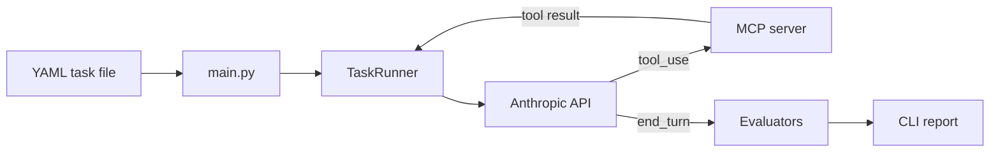

# agent-eval

YAML test suites for Claude agents. Define a prompt and pass criteria, run the suite, get pass/fail with token and latency stats.

## Quick start

Text-only tasks (no MCP):

```bash
uv sync --all-groups
cp .env.example .env   # add ANTHROPIC_API_KEY

uv run agent-eval run tasks/example.yaml
```

Tool tasks — point at any **Streamable HTTP** MCP server:

```bash
cp .env.example .env   # ANTHROPIC_API_KEY + MCP_AUTH_TOKEN if your server needs it

uv run agent-eval run tasks/my_tools.yaml \
  --mcp-url https://mcp.example.com
```

- **`--mcp-url`** is required when any task has non-empty `tools_allowed` (normalized to end with `/mcp`).
- At suite start, agent-eval calls **`list_tools()`** on that server and maps schemas for Claude.
- Per-task **`tools_allowed`** filters which tools Claude may call (names must exist on the server).

### MCP auth (env)

Secrets stay in `.env`, not in YAML.

| Variable | Purpose |
|----------|---------|
| `MCP_AUTH_TOKEN` | Static Bearer token (`Authorization: Bearer …`). |
| `MCP_HEADERS` | Optional JSON object of extra HTTP headers. `Authorization` from `MCP_AUTH_TOKEN` wins over any `Authorization` key in this JSON. |
| `GATEWAY_JWT_SECRET` | Local gateway demo only — mints a short-lived HS256 JWT when `MCP_AUTH_TOKEN` is unset. |

## Task format

```yaml
tasks:
  - id: t001
    name: "Simple factual lookup"
    prompt: "What is the capital of France?"
    tools_allowed: []
    success_criteria:
      type: contains_substring
      value: "Paris"
```

Success criteria: `contains_substring`, `regex_match`, `tool_sequence`. See [Plan.md](Plan.md) for details.

## Options

```bash
uv run agent-eval run tasks/example.yaml --model claude-haiku-4-5 --max-turns 10
uv run agent-eval run tasks/my_tools.yaml --mcp-url https://mcp.example.com
```

## How it works



1. Load tasks from YAML and validate with Pydantic
2. If the suite uses tools, connect to `--mcp-url`, discover tools, validate `tools_allowed` names
3. Send each prompt to Claude with the filtered tool definitions
4. Forward tool calls to the MCP server until Claude finishes or `max_turns`
5. Check the response against `success_criteria` and print pass/fail, tokens, and latency

## Project layout

```
agent-eval/
├── main.py              # CLI entry point
├── runner.py            # Claude turn loop + tool forwarding
├── models.py            # Task, SuccessCriteria, TaskResult
├── mcp_client.py        # Streamable HTTP MCP client
├── mcp_tools.py         # MCPToolService — list_tools → Anthropic defs
├── evaluators/          # pass/fail checks
├── tasks/               # example YAML suites
├── scripts/             # local gateway demo helpers
├── pyproject.toml
├── .env.example
├── README.md
└── Plan.md
```

---

## Appendix — Local MCP Gateway demo

Optional integration example: [MCP-Gateway](https://github.com/FabioDiCeglie/MCP-Gateway) + demo `echo` tool in Docker.

```bash
./scripts/mcp-up.sh
# Set GATEWAY_JWT_SECRET in .env to match .mcp-gateway/.env

uv run agent-eval run tasks/mcp_example.yaml --mcp-url http://localhost:8080
```

Gateway policy (`policy.yaml`) still controls which tools the upstream allows; agent-eval only filters what Claude sees per task via `tools_allowed`. Stop stacks with `./scripts/mcp-down.sh`.
