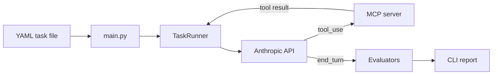

# Agent-eval

CI for AI agents. Catch regressions before they reach production.

## Badges


YAML test suites for Claude agents. Define a prompt and pass criteria, run the suite, get pass/fail with token and latency stats.

## Quick start

```bash
uv sync --all-groups
cp .env.example .env   # ANTHROPIC_API_KEY

# Tool suite against a public MCP (no Docker, no MCP API key)
GATEWAY_JWT_SECRET= MCP_AUTH_TOKEN= uv run agent-eval run tasks/mcp_public.yaml \
  --mcp-url https://mcp.dlptest.com/api/mcp/
```

Hosted endpoint: [DLP Test MCP](https://dlptest.com/mcp/) (synthetic data tools). Tool suites need **`--mcp-url`**; agent-eval discovers tools via `list_tools()` and filters per task with **`tools_allowed`**.

Text-only (no MCP):

```bash
uv run agent-eval run tasks/example.yaml
```

## CLI

```bash
uv run agent-eval run SUITE.yaml \
  --model claude-haiku-4-5 \
  --max-turns 10 \
  --mcp-url URL
```

| Option | Default | Description |
|--------|---------|-------------|
| `SUITE` | — | Path to YAML task file (required) |
| `--model` | `claude-haiku-4-5` | Claude model |
| `--max-turns` | `10` | Max agent turns per task |
| `--mcp-url` | — | MCP server URL; **required** if any task has non-empty `tools_allowed` |

## Task format

```yaml
tasks:
  - id: t001
    name: "Simple factual lookup"
    prompt: "What is the capital of France?"
    tools_allowed: []
    success_criteria:
      type: contains_substring
      value: "Paris"
```

**Success criteria**

| `type` | Fields | Pass when |
|--------|--------|-----------|
| `contains_substring` | `value` | Final reply contains `value` |
| `regex_match` | `value` | Final reply matches regex `value` |
| `tool_sequence` | `sequence` | Tool calls match names in order |

## How it works



## Appendix — local MCP Gateway demo

Optional Docker stack ([MCP-Gateway](https://github.com/FabioDiCeglie/MCP-Gateway)): set `GATEWAY_JWT_SECRET` in `.env` to match `.mcp-gateway/.env`, then:

```bash
./scripts/mcp-up.sh
uv run agent-eval run tasks/mcp_example.yaml --mcp-url http://localhost:8080
./scripts/mcp-down.sh
```

For other MCP servers that require a Bearer token, set `MCP_AUTH_TOKEN` in `.env`. Details in `.env.example`.

## CI

On every push to `main`, GitHub Actions runs unit tests and `tasks/mcp_public.yaml` against [DLP Test MCP](https://mcp.dlptest.com/api/mcp/) (no Docker, no MCP API key). Add **`ANTHROPIC_API_KEY`** as a repository secret so Claude calls can run in CI.
