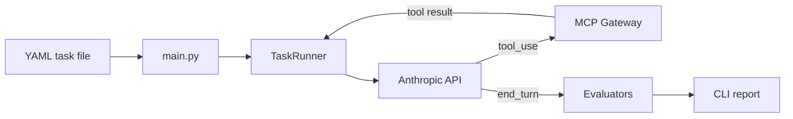

# agent-eval

YAML test suites for Claude agents. Define a prompt and pass criteria, run the suite, get pass/fail with token and latency stats.

## Quick start

```bash
uv sync --all-groups
cp .env.example .env   # add ANTHROPIC_API_KEY

uv run agent-eval run tasks/example.yaml
```

## Task format

```yaml
tasks:
  - id: t001
    name: "Simple factual lookup"
    prompt: "What is the capital of France?"
    tools_allowed: []
    success_criteria:
      type: contains_substring
      value: "Paris"
```

Success criteria: `contains_substring`, `regex_match`, `tool_sequence`. See [Plan.md](Plan.md) for details.

## Tool tasks (MCP Gateway)

```bash
./scripts/mcp-up.sh
uv run agent-eval run tasks/mcp_example.yaml --mcp-url http://localhost:8080
```

Set `GATEWAY_JWT_SECRET` in `.env` to match the gateway (see `.env.example`). `tasks/mcp_example.yaml` only uses tools allowed by the gateway’s default `policy.yaml` (`echo`).

### MCP URL

Pass **`--mcp-url`** when the suite uses tools (no env var, no YAML field).

### MCP auth (env)

| Variable | Purpose |
|----------|---------|
| `MCP_AUTH_TOKEN` | Static Bearer token sent as `Authorization: Bearer …`. If set, **overrides** JWT minting from `GATEWAY_JWT_SECRET`. |
| `GATEWAY_JWT_SECRET` | Mint a short-lived HS256 JWT (local gateway demo). Used when `MCP_AUTH_TOKEN` is unset. |
| `MCP_HEADERS` | Optional JSON object of extra HTTP headers (e.g. API keys). `Authorization` from `MCP_AUTH_TOKEN` or JWT **overrides** any `Authorization` key in this JSON. |

## Options

```bash
uv run agent-eval run tasks/example.yaml --model claude-haiku-4-5 --max-turns 10
uv run agent-eval run tasks/mcp_example.yaml --mcp-url http://localhost:8080
```

## How it works



1. Load tasks from YAML and validate with Pydantic
2. Send each prompt to Claude (with optional tools)
3. If Claude calls a tool, forward the request to the MCP Gateway and loop
4. When Claude finishes, check the response against `success_criteria`
5. Print pass/fail, tokens, and latency per task

## Project layout

```
agent-eval/
├── main.py              # CLI entry point
├── runner.py            # Claude turn loop + tool forwarding
├── models.py            # Task, SuccessCriteria, TaskResult
├── mcp_client.py        # MCP Gateway client
├── evaluators/          # pass/fail checks
│   ├── substring.py
│   ├── regex_eval.py
│   └── tool_sequence.py
├── tasks/               # example YAML suites
│   ├── example.yaml
│   └── mcp_example.yaml
├── config/
│   └── mcp-gateway.env.example
├── scripts/
│   ├── mcp-up.sh
│   └── mcp-down.sh
├── pyproject.toml
├── .env.example
├── README.md
└── Plan.md
```
